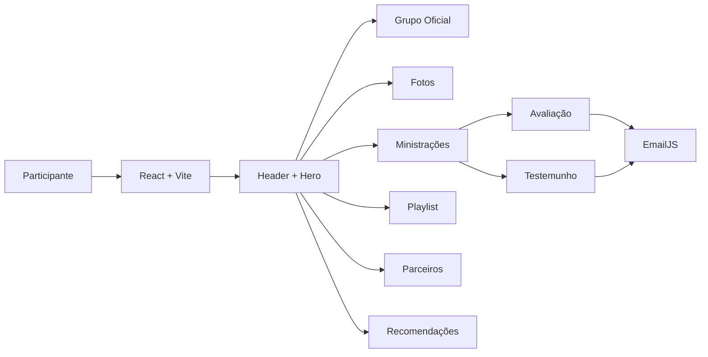
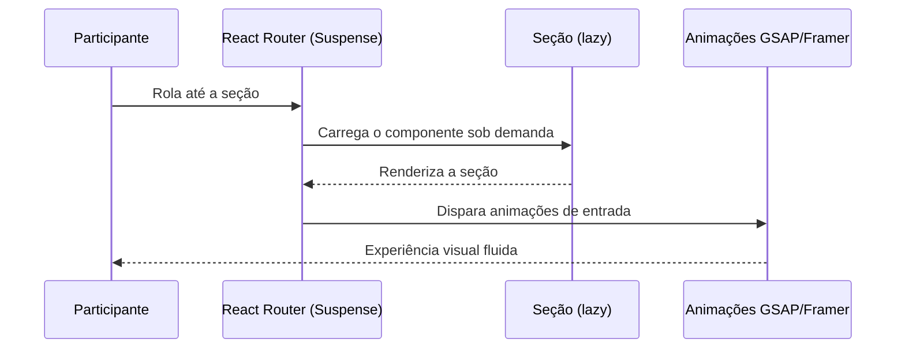

<p align="center"><a href="https://github.com/Carlos2505dev/rios-do-espirito-2026" target="_blank"></a></p>

<p align="center">
<a href="https://opensource.org/licenses/MIT"></a>
<a href="https://github.com/Carlos2505dev/rios-do-espirito-2026"></a>
<a href="https://github.com/Carlos2505dev/rios-do-espirito-2026"></a>
</p>

<p align="center">
<a href="https://skillicons.dev">
  
</a>
</p>

## Sobre o Projeto

**Um espaço exclusivo para quem viveu a conferência.**

A Conferência Rios do Espírito (CRE'26) aconteceu entre os dias 18 e 20 de junho de 2026, no Verbo da Vida Cabula, em Salvador/BA. Este site foi construído para os **participantes** do evento: um portal pós-conferência onde tudo o que foi vivido continua acessível: ministrações, fotos, playlists e memórias.

O acesso é **pessoal e intransferível**: o link da página é compartilhado apenas com quem esteve conosco, e os conteúdos disponibilizados aqui (em especial os vídeos das ministrações) são de uso exclusivo dos participantes. Por isso, o site pede que os links **não sejam repassados**: o que você pode e deve compartilhar são as suas fotos, com a hashtag **#CRE2026**.

Construído com React, TypeScript e Tailwind CSS, o portal combina animações imersivas (GSAP + Framer Motion), carregamento sob demanda das seções e dois formulários integrados (avaliação da conferência e envio de testemunhos), tudo otimizado para performance e para a experiência móvel, já que a maior parte do público acessa pelo celular.

## ✨ O que o Projeto faz

O portal hoje:

| Recurso                           | O que resolve                                    | Status                |
| --------------------------------- | ------------------------------------------------ | --------------------- |
| **Hero de boas-vindas**           | Recebe o participante com a identidade do evento | ✅ Pronto              |
| **Grupo Oficial**                 | Convite para o grupo de WhatsApp da conferência  | ✅ Pronto              |
| **Galeria Memórias CRE'26**       | Álbuns de fotos por dia (Google Drive) + marquee | ✅ Pronto              |
| **Ministrações**                  | Vídeos exclusivos das mensagens da conferência   | ✅ Pronto              |
| **Playlist O Som do Rio**         | Louvores do evento no Spotify e YouTube          | ✅ Pronto              |
| **Parceiros**                     | Carrossel de patrocinadores com links (Instagram)| ✅ Pronto              |
| **Recomendações**                 | Incentivo a compartilhar fotos com a #CRE2026    | ✅ Pronto              |
| **Avaliação da Conferência**      | Formulário de feedback enviado por EmailJS       | ✅ Pronto              |
| **Envio de Testemunhos**          | Formulário com autorização de uso via EmailJS    | ✅ Pronto              |
| **Animações GSAP + Framer Motion**| Experiência imersiva e envolvente                | ✅ Pronto              |

<details>
<summary><strong>📋 Ver todos os recursos</strong></summary>

### Seções da Home

* Hero com logo, boas-vindas e mensagem de propósito do portal
* Seção do Grupo Oficial com botão de entrada no WhatsApp
* Galeria com os álbuns de fotos de cada dia (Drive) e carrossel de imagens
* Cards de ministrações com foto do ministro e flip para assistir o vídeo
* Aviso de exclusividade sobre os links das ministrações
* CTA para envio de testemunho
* Seção de avaliação da conferência (formulário)
* Playlist oficial com acesso direto a Spotify e YouTube
* Carrossel infinito de parceiros com links diretos para o Instagram
* Seção "Espalhe as Águas" com hashtag #CRE2026 e perfis para seguir

### Formulários

* `/feedback`: avaliação da estrutura, organização e experiência geral (pode ser anônimo)
* `/testemunhos`: relato da experiência com orientações por etapas e autorização de uso
* Envio via EmailJS com template dedicado para cada formulário
* Validação de campos obrigatórios e estado de sucesso com animação

### Técnica

* SPA com React Router (`/`, `/feedback`, `/testemunhos`)
* Lazy loading com Suspense: seções e páginas carregam sob demanda
* Animações com GSAP (parallax e revelação de textos) e Framer Motion (entradas e formulários)
* Borda "elétrica" em canvas para os cards de ministrações
* Cursor customizado com suavização (lerp) e estado de hover
* Header com transição transparente → sólida conforme o scroll
* Fontes próprias: Aeonik, Blauer Neue, Quentin, Teenage Dreams e Antarctican Mono

</details>

## 📦 Instalação

### Pré-requisitos

```text
Node.js >= 18
npm, yarn ou bun
```

### Instalação

```bash
git clone https://github.com/Carlos2505dev/rios-do-espirito-2026.git

cd site-participantes

npm install
# ou
bun install

npm run dev
```

O servidor de desenvolvimento abre automaticamente no navegador em:

```text
http://localhost:3100
```

### Variáveis de ambiente

Copie o arquivo `.env` (ou crie um novo) com as credenciais do EmailJS, necessárias para o envio dos formulários:

```text
VITE_EMAILJS_SERVICE_ID=
VITE_EMAILJS_TEMPLATE_FEEDBACK_ID=
VITE_EMAILJS_TEMPLATE_TESTEMUNHOS_ID=
VITE_EMAILJS_PUBLIC_KEY=
```

## 🚀 Primeiros Passos

### 1. Reviva a conferência

Na home, explore a **Galeria Memórias CRE'26**: os álbuns do Google Drive de cada dia (abertura, sexta-feira, sábado à tarde e noite de encerramento) e o carrossel de fotos.

### 2. Assista às ministrações

Na seção **Ministrações**, passe o mouse (ou toque) nos cards para virar e acessar o vídeo de cada mensagem. Lembre-se: os links são **exclusivos dos participantes**: não repasse.

### 3. Continue adorando

Na **Playlist O Som do Rio**, acesse os louvores da conferência direto no Spotify ou no YouTube, na sua plataforma favorita.

### 4. Avalie e compartilhe

Deixe sua **avaliação** em `/feedback` e envie seu **testemunho** em `/testemunhos`. E espalhe as águas: publique suas fotos com a hashtag **#CRE2026** e marque os perfis da conferência.

A partir daí:

```text
Acessar o portal (link pessoal)
    ↓
Reviver fotos e ministrações
    ↓
Continuar adorando com a playlist
    ↓
Avaliar e enviar testemunho
    ↓
Compartilhar as próprias fotos (#CRE2026)
```

## 🧠 Como Funciona

O portal é uma SPA (single-page application) com três rotas gerenciadas pelo React Router. A home é composta por seções independentes (`Hero`, `GrupoOficial`, `Fotos`, `Ministracoes`, `Avaliacao`, `Playlist`, `Partners` e `Recomendacoes`), e as seções abaixo da dobra são carregadas sob demanda:

```tsx
import { Suspense, lazy } from 'react';

const Ministracoes = lazy(() => import('./components/Ministracoes'));

<Suspense fallback={<div className="h-32" />}>
  <Ministracoes />
</Suspense>
```

Enquanto o `Header`, o `Hero` e a primeira seção carregam para exibição instantânea, as demais chegam em segundo plano, mantendo o FCP e o LCP rápidos, essencial no mobile, principal canal de acesso dos participantes:



<details>
<summary><strong>🏗️ Detalhes da arquitetura</strong></summary>

### Rotas

| Rota              | Página                       | Carregamento          |
| ----------------- | ---------------------------- | --------------------- |
| `/`               | Home (todas as seções)       | Suspense por seção    |
| `/feedback`       | Formulário de avaliação      | Suspense + spinner    |
| `/testemunhos`    | Formulário de testemunho     | Suspense + spinner    |

### Componentes

| Componente                        | Responsabilidade                       |
| --------------------------------- | -------------------------------------- |
| `src/components/ui`               | Componentes base (button, spinner)     |
| `src/components/Header.tsx`       | Logo e header com transição no scroll  |
| `src/components/Hero.tsx`         | Boas-vindas com parallax e fade        |
| `src/components/GrupoOficial.tsx` | Convite para o grupo do WhatsApp       |
| `src/components/Fotos.tsx`        | Álbuns do Drive + carrossel de fotos   |
| `src/components/Ministracoes.tsx` | Cards flip com vídeos exclusivos       |
| `src/components/Avaliacao.tsx`    | Seção que leva ao formulário de avaliação |
| `src/components/Playlist.tsx`     | Links para Spotify e YouTube           |
| `src/components/Partners.tsx`     | Carrossel de parceiros (GSAP via CDN)  |
| `src/components/Recomendacoes.tsx`| Hashtag #CRE2026 e perfis do Instagram |
| `src/components/Footer.tsx`       | Aviso de acesso exclusivo e créditos   |
| `src/pages/feedbacks.tsx`         | Formulário de avaliação (EmailJS)      |
| `src/pages/testemunhos.tsx`       | Formulário de testemunho (EmailJS)     |

### Fluxo de carregamento de uma seção



### Decisão: Vite + React

Vite entrega builds rápidos com HMR instantâneo, e React mantém o estado dos formulários (validação, carregamento e envio) de forma reativa e previsível.

### Decisão: TypeScript

Tipagem rigorosa é essencial aqui: os dados das ministrações, álbuns de fotos e parceiros são manipulados em várias seções, e os formulários dependem de contratos claros com o EmailJS. A tipagem estática evita bugs silenciosos e melhora a manutenção.

### Decisão: Tailwind CSS v4

Design system utilitário que mantém o CSS do bundle mínimo, com tokens de cor e fontes centralizados em `src/index.css`.

</details>

## 🗂️ Estrutura do Projeto

```text
site-participantes/
├── public/
│   ├── assets/                  # Logos, fotos, ministros e álbuns
│   │   ├── 2024/                # Fotos da edição de 2024
│   │   ├── 2025/                # Fotos da edição de 2025
│   │   ├── Ministros/           # Fotos dos ministros
│   │   └── Patrocinadores/      # Logos dos parceiros
│   └── fonts/                   # Aeonik, Blauer Neue, Quentin, etc.
├── src/
│   ├── components/
│   │   ├── ui/                  # Componentes base (button, LoadingSpinner)
│   │   ├── Header.tsx           # Logo e header responsivo ao scroll
│   │   ├── Hero.tsx             # Boas-vindas com parallax
│   │   ├── GrupoOficial.tsx     # Grupo oficial do WhatsApp
│   │   ├── Fotos.tsx            # Álbuns e carrossel de fotos
│   │   ├── Ministracoes.tsx     # Vídeos exclusivos (cards flip)
│   │   ├── Avaliacao.tsx        # CTA para o formulário de avaliação
│   │   ├── Playlist.tsx         # Playlist oficial (Spotify/YouTube)
│   │   ├── Partners.tsx         # Carrossel de parceiros
│   │   ├── Recomendacoes.tsx    # Compartilhamento com #CRE2026
│   │   ├── Footer.tsx           # Aviso de exclusividade e créditos
│   │   ├── CustomCursor.tsx     # Cursor customizado
│   │   └── ElectricBorder.tsx   # Borda animada em canvas
│   ├── pages/
│   │   ├── feedbacks.tsx        # Formulário de avaliação
│   │   ├── feedbacks.css        # Estilos do formulário de avaliação
│   │   ├── testemunhos.tsx      # Formulário de testemunho
│   │   └── testemunhos.css      # Estilos do formulário de testemunho
│   ├── styles/
│   │   └── global-custom.css    # Estilos globais e animações
│   ├── lib/
│   │   └── utils.ts             # Utilitários (cn)
│   ├── App.tsx                  # Rotas e composição com Suspense
│   ├── index.css                # Design tokens (Tailwind v4)
│   └── main.tsx                 # Entry point
├── .env                         # Credenciais do EmailJS
├── .gitignore
├── components.json
├── eslint.config.js
├── index.html
├── package.json
├── tsconfig.json
├── tsconfig.app.json
├── tsconfig.node.json
├── vercel.json                  # Rotas SPA e headers de segurança
├── vite.config.ts
├── LICENSE
└── README.md
```

<details>
<summary><strong>📁 Explicação da estrutura</strong></summary>

| Caminho                       | Objetivo                                  |
| ----------------------------- | ----------------------------------------- |
| `src/components/ui`           | Componentes base reutilizáveis            |
| `src/components`              | Seções da home                            |
| `src/pages`                   | Páginas de formulário (`/feedback`, `/testemunhos`) |
| `src/styles`                  | Estilos globais e animações customizadas  |
| `src/App.tsx`                 | Rotas e composição das seções com Suspense|
| `src/index.css`               | Tokens de design e estilos Tailwind       |
| `public/assets`               | Logos, fotos e vídeos do evento           |
| `public/fonts`                | Fontes do design system                   |

### Arquitetura

O portal adota uma **arquitetura em camadas**, separando a interface da lógica de negócio:

| Camada           | Diretórios                     | Responsabilidade                            |
| ---------------- | ------------------------------ | ------------------------------------------- |
| **Apresentação** | `src/components`               | Seções, animações e experiência do usuário  |
| **Páginas**      | `src/pages`                    | Formulários e fluxos completos              |
| **Integração**   | `src/pages` + `@emailjs`       | Envio de avaliação e testemunhos            |
| **Contratos**    | Tipos inline nos componentes   | Tipos e interfaces das seções               |

**Por que essa arquitetura?**

- **Manutenibilidade**: cada seção evolui de forma independente. Alterar a playlist não afeta os formulários e vice-versa.
- **Performance**: header e hero carregam primeiro; o resto chega sob demanda via `Suspense`.
- **Separação de responsabilidades**: conteúdo (fotos, ministrações, parceiros) e fluxos de formulário não se acoplam entre si.
- **Escalabilidade**: novas seções ou rotas podem ser adicionadas sem reestruturar o projeto.

</details>

## ⚙️ Configurações Avançadas

<details>
<summary><strong>🔧 Variáveis de ambiente</strong></summary>

O projeto usa o **EmailJS** para o envio dos formulários de avaliação e testemunho. Sem as credenciais, o site roda normalmente, mas os formulários exibem um erro ao enviar.

| Variável                               | Obrigatória | Descrição                                  |
| -------------------------------------- | ----------: | ------------------------------------------ |
| `VITE_EMAILJS_SERVICE_ID`              |          ✅ | ID do serviço EmailJS                      |
| `VITE_EMAILJS_TEMPLATE_FEEDBACK_ID`    |          ✅ | Template do formulário de avaliação        |
| `VITE_EMAILJS_TEMPLATE_TESTEMUNHOS_ID` |          ✅ | Template do formulário de testemunhos      |
| `VITE_EMAILJS_PUBLIC_KEY`              |          ✅ | Chave pública do EmailJS                   |

</details>

<details>
<summary><strong>🧪 Lint e build</strong></summary>

Lint:

```bash
npm run lint
```

Type-check:

```bash
npx tsc --noEmit
```

Build de produção:

```bash
npm run build
```

Preview do build:

```bash
npm run preview
```

</details>

<details>
<summary><strong>🚢 Deploy</strong></summary>

O deploy é feito na **Vercel**, usando `vercel.json` com:

* Rota SPA: todas as rotas (`/`, `/feedback`, `/testemunhos`) caem no `index.html`
* Headers de segurança: `X-Content-Type-Options`, `X-Frame-Options` (DENY), `X-XSS-Protection` e HSTS
* Cache imutável para `assets/` e `fonts/` (um ano)

</details>

<details>
<summary><strong>🧑‍🔬 Testes</strong></summary>

Unitários:

```bash
npm test
```

E2E:

```bash
npm run test:e2e
```

Lint:

```bash
npm run lint
```

Type-check:

```bash
npx tsc --noEmit
```

> Os scripts de testes unitários e E2E ainda não estão configurados no projeto. Lint e Type-check estão disponíveis atualmente.

</details>

## 🐛 Reportando Problemas

Abra uma [Issue](https://github.com/Carlos2505dev/rios-do-espirito-2026/issues/new) contendo:

```text
### Descrição

Explique o problema.

### Como reproduzir

1. ...
2. ...
3. ...

### Resultado esperado

...

### Ambiente

- OS:
- Navegador:
- Versão da página:
```

## 🔒 Segurança

O portal contém conteúdo exclusivo para participantes, e por isso segue boas práticas de segurança:

* O link de acesso é **pessoal e intransferível**
* Não publique vulnerabilidades de segurança em Issues públicas: envie um relatório para:

**[carlosbezerrajr2007@gmail.com](mailto:carlosbezerrajr2007@gmail.com)**

## ❓ FAQ

<details>
<summary><strong>Quem pode acessar o site?</strong></summary>

Apenas participantes da Conferência Rios do Espírito 2026 que receberam o link pessoal de acesso.

</details>

<details>
<summary><strong>Posso compartilhar os links das ministrações?</strong></summary>

Não. Os vídeos são de uso exclusivo dos participantes, e o site pede que eles não sejam repassados ou publicados externamente.

</details>

<details>
<summary><strong>O que devo compartilhar, então?</strong></summary>

As suas fotos! Publique seus registros no Instagram com a hashtag **#CRE2026** e marque os perfis da conferência.

</details>

<details>
<summary><strong>Preciso criar uma conta para enviar avaliação ou testemunho?</strong></summary>

Não. Os dois formulários podem ser enviados anonimamente, sem cadastro.

</details>

<details>
<summary><strong>Onde encontro as fotos da conferência?</strong></summary>

Na seção **Galeria Memórias CRE'26**, com álbuns do Google Drive separados por dia (abertura, sexta, sábado à tarde e noite de encerramento).

</details>

<details>
<summary><strong>O que acontece com o meu testemunho?</strong></summary>

Ele é enviado para a equipe da conferência e, se você autorizar, poderá ser usado em conteúdos de divulgação (redes sociais, site e materiais).

</details>

## 💙 Agradecimentos

Obrigado a cada participante que viveu a Conferência Rios do Espírito 2026 e continua edificando a igreja com seus testemunhos. Obrigado aos ministros que serviram a palavra, à equipe que organizou tudo e aos parceiros que apoiaram o evento.

<div align="center">

  

  <p><em>Vidas transformadas à margem de um grande rio.</em></p>

  <p>
    <a href="https://github.com/Carlos2505dev/rios-do-espirito-2026"></a>
    <a href="https://opensource.org/licenses/MIT"></a>
  </p>

  <p>
    <a href="https://github.com/Carlos2505dev/rios-do-espirito-2026">GitHub</a>
  </p>

  <p><a href="#readme">⬆ Voltar ao topo</a></p>

</div>